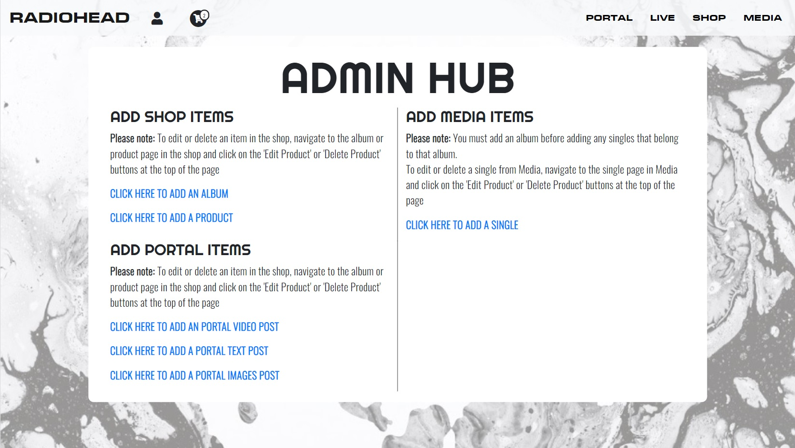
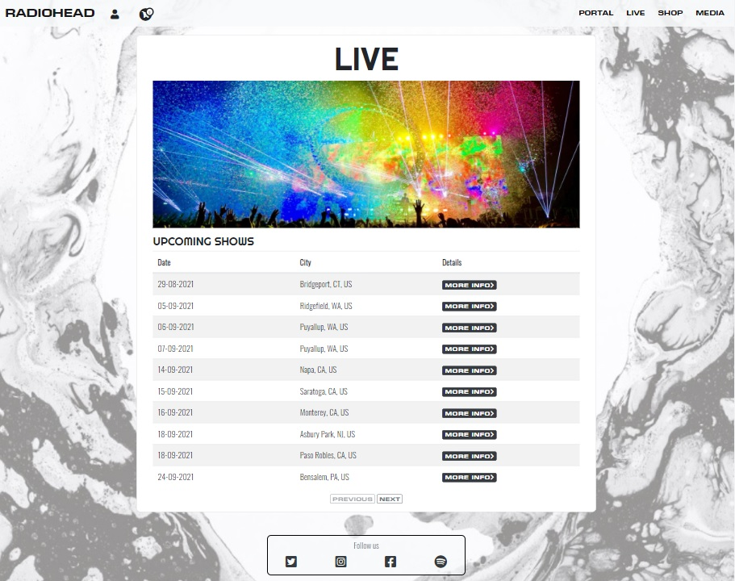

# Radiohead - Milestone 4

A mock website for the band Radiohead, featuring on online shop, exclusive content subscription service, API powered gig listings and media hub.

[Click here to view live website](https://radiohead-ms4.herokuapp.com/)
## Table of Contents
[Website Objectives](#objectives)

[User Experience - UX](#UX)

[Design](#design)

[Features](#features)

[Languages and Technologies](#tech)

[Testing](testing.md) (link to separate page)

[Deployment](deployment.md) (link to separate page)

[Credits](#credits)

## Website Objectives
The primary objectives of the website are to:
* Functionality to sell music and merchandise.
* Promote upcoming concerts.
* Provide a platform for the band to announce news and release content.
* Financially capitalise on fans.

## UX
### User Profiles

### User Stories
#### As a first time user, I want:
* To quickly understand the purpose of the website.
* To be able to register and sign in easily.
* To be able to sign out easily.
* To be able to navigate through the website intuitively and easily.
* To find content relating to the band Radiohead.

#### As a returning user, I want:
* To be able to log in and out easily and to be able to remain signed in.
* To be able to reset my password should I forget it.
* To be able to find details about my previous orders.
* To be able to view details about my subscription.
* To be able to easily cancel my subscription.
* To be able to easily reactivate my subscription after cancelling.
* To be able to change my subscription payment card.
* To be able to save my details to use for any future purchases.
* To be able to find new merchandise quickly in the shop.
* To be able to find new music quickly in the Media section.
* To be able to view new content quickly in the Portal area.

#### Shared user requirements:
* To be able to communicate with other fans of the band.
* To be able to buy music and merchandise from the band.
* To be able to find details about upcoming concerts.
* To be able to find and consume music.
* To be able to find recent news, updates and other content.

## Design
### Wireframes
[Click here to see 'Index' wireframes](readme-images/wireframes/index.png)

[Click here to see 'Add Portal Item' wireframes](readme-images/wireframes/add-portal-item.png)

[Click here to see 'Add Product' wireframes](readme-images/wireframes/add-product.png)

[Click here to see 'Media- Album Singles' wireframes](readme-images/wireframes/album-singles.png)

[Click here to see 'Basket' wireframes](readme-images/wireframes/basket.png)

[Click here to see 'Checkout' wireframes](readme-images/wireframes/checkout.png)

[Click here to see 'Live Detail' wireframes](readme-images/wireframes/live-detail.png)

[Click here to see 'Live' wireframes](readme-images/wireframes/live.png)

[Click here to see 'Media - Single Detail' wireframes](readme-images/wireframes/media-single-detail.png)

[Click here to see 'Media' wireframes](readme-images/wireframes/media.png)

[Click here to see 'Order Confirmation/Order History Detail' wireframes](readme-images/wireframes/order-confirmation.png)

[Click here to see 'Portal Item' wireframes](readme-images/wireframes/portal-item.png)

[Click here to see 'Portal (signed-in)' wireframes](readme-images/wireframes/portal-signed-in.png)

[Click here to see 'Portal (signed-out)' wireframes](readme-images/wireframes/portal-signed-out.png)

[Click here to see 'Shop - Product Detail' wireframes](readme-images/wireframes/product-detail.png)

[Click here to see 'Profile' wireframes](readme-images/wireframes/profile.png)

[Click here to see 'Shop' wireframes](readme-images/wireframes/shop.png)

[Click here to see 'Sign-in/Sign-up' wireframes](readme-images/wireframes/sign-up.png)

### Colour Scheme
The website is almost entirely monochromatic, with most components consitsing of white, grey and black. This results a very clean and simple and elegant user interface whilst also allowing features such as images to contrast sharply on the page. The static background image which can be found on every page provides a nice backdrop which makes the page more interesting visually whilst not overpowering the general aesthetic.

### Fonts
#### Logo and Navigation Links
The font found throughout the website header is EuroseWide Heavy. This font is used by Radiohead on much of their official branding, including the band logo on the album 'OK Computer'. As the font is bold and highly legible, it was an obvious choice for both the Logo and navigation links.

#### Headers
The header font was chosen due to its similarity to the font found on the cover of the album 'Kid A'. Whilst the actual Kid A font (BD Plakatbau) was used in the 'Welcome to the home of Radiohead' animation on the home page, it lacked several punctuation charactors, making it unsuitable to use throughout the website. 
The font 'Righteous' from Google fonts was used as a replacement for all headers due to it's similarity to 'BD Plakatbau'.

#### Main content
The font found throughout the main body of the website is 'Oswald' from Google Fonts. The font is highly legible and compliments the 'Righteous' found found in the headers.

### Database Schema
Below is a diagram detailing the database schema, with the connecting lines showing the tables relationships to one another.

## Features
### Shared Features
#### Header

* The header element, which features the websites navigation links and logo is at the top of every page on the website.
    * The header is responsive, with the navigation links moving into a dropdown menu on screens 1200px and smaller.
    * The header features a seperate dropdown for functionality relating to user profiles and signing in and out.
    * The shopping cart icon displays the current number of individual items in the users bag
        * Clicking on the shopping cart icon diplays items currently in the users shopping bag as well as the price totals, including how much more the user needs to spend to be eligable for free postage.
        
* Only one dropdown menu can be viewed at once. If the user click on a dropdown menu icon whilst a different dropdown is being displayed, a Javascript function is called to hide the original dropdown. This ensures the screen doesn't get overloaded with dropdown menus.
* Every page can display messages in the form of a 'toast', which appear just below the website header. These messages are available to the user to view for 4 seconds before fading away. The toast features different colour highlights for different message categories (green for success, blue for general information, red for errors).

#### Footer
* Every page features a simple footer which contains links to the band's social media and Spotify channels.

#### Site-wide Features
* The website is responsive down to a screen size of 320px
* Where possible, the URL scheme features 'slugified' URLs which provide more meaningful and understandable URL's

#### Authentication and Security Features
* The website's authentication features are implemented using django-allauth. This 3rd party package provides the website's sign-in and sign-out functionality, as well as providing basic templates to the authentication pages which have then been customised to match the rest of the wesites design and branding.
* Any restricted pages or views (either due to being for website staff or to paying users) redirect users that try to access them without the correct credentials.
* All secret keys related to the website are kept in enviromental variables and have been kept out of source control.
* All payments are handled by the Stripe API.
* Access to the websites subscription content can only be accessed after a webhook from the Stripe API has been received confirming a successful payment and active subscription.

#### Staff User Features
* If the logged in user has staff privileges, additional links are rendered on certain pages.
    * In the profiles dropdown menu found in the header, an additional link to the 'Admin Hub' is rendered.
    
        * Within the 'Admin Hub', users can quickly navigate to any areas of the website that deal with adding content (such as shop products, media content and portal blog posts), as well as some brief additional information. These links can also be found at the top of each app's main page.
    * Staff users can edit or delete individual shop products, media items and portal blog posts by navigating to the item and clicking the 'edit' or 'delete' buttons that are rendered at the top of the content.
    * Staff users can delete comments made by other users in the Media and Portal apps.
    * Staff users can not access the main website admin features provided by Django, such as editing the database.

### Individual App features
#### Home App Features

* A simple landing page (index.html) featuring a Javascript powered welcome text animation and a brief description of the websites 'Portal' subscription service.
* An 'Admin Hub', as described in the 'Staff User Features' section above.

#### Profiles App Features

* The Profile app allows users to add and update delivery information, add a profile image, view the details of their Portal subscription if one exists, and browse a list of previous orders.
* If a user has an active Portal subscription, the option to cancel the subscription or to change the payment method are presented on the profile page.
* By clicking on an order in the 'Order History' section of the profile page, the user is directed to an 'Order Details' page containing details about the order.

#### Live App Features

* The Live app provides users with a paginated list of upcoming concerts. 
* Concert listings are provided by the Songkick API. As Radiohead don't actually have any upcoming gigs, the results currently on the website are in fact for The Beach Boys. Slightly different vibe but probably still a great concert.
* The table that contains the concert listings is responsive, with the table headers moving to the left hand side on screen sizes of 768px and less.
* Clicking on the 'More Info' button of a concert listing takes the user to the 'Event Info' page. This page contains more information about the concert as well as a map showing the location of the venue on an interactive map. The map is powered by the Google Maps API.

* Cicking on the 'Find Tickets' button on the 'Event Info' page links to the Songkick website and a page which contains links to ticket vendors for the concert.

#### Media App Features

* The Media app provides users with access to all music videos that belong to singles released by the band.
* The singles are grouped by the album from which they came.
* Whilst browsing an albums singles, a link to view to album in the shop is always on screen.
* When on a 'Single Detail' page, a Javascript function ensures that the Youtube iframe is always a good size for the users viewport.
* Each 'Single Detail' page features a link to view the related album in the shop, and to listen to the album on Spotify.
* Logged in users can leave comments underneath the video. Comments are sent and rendered asynchronously to allow the video to play uninterupted.

#### Portal App

* The Portal app contains the content that is made available to users only by paying a subscription fee.
* If a non subscribed user clicks on a 'Portal' link in the navbar or anywhere else thoughout the website, a page that explains the benefits of subscribing is presented, as well as links to either register/sign-in or subscribe.
* If a subscribed user or staff member clicks on a 'Portal' link, they are automatically redirected to the actual portal content.
* Portal content comes in three different formats, each with slightly different templates:
    * Text post - The post is just text and does not feature any additional media (ie. videos or images).
    * Video post - The post features text content as well as a video. The page features a Javascript function which ensures that the Youtube iframe is always a good size for the users viewport.
    * Images post - The post contains text content as well as up to 8 images which are viewed in a Bootstrap carousel.
* All posts include a comment feature at the bottom of the page. Comments are sent and rendered asynchronously to allow the video to play uninterupted.
* When on the main portal page, users can filter the types of post they want to see using the buttons at the top of the page.

#### Shop App

* The Shop app provides a paginated list of items for sale.
* Items in the shop can be filtered by 'Music', 'Clothing' or 'Other'.
* Different templates are used to present different products in the shop.
* The album template allows users to select a product of a certain format(CD or Vinyl) as well as displaying the albums tracklisting.
* The product template allows users to choose as size if sizes for that product are available(Small, Medium and Large).
* Both templates allow users to select a quantity of the product to add to their bag.

#### Bag App

* The bag app allows users to view the current contents of their bag, as well as update any quantities or remove items entirely
* Whilst viewing the bag, the individual costs are presented to the user (order total, delivery total and grand total) These costs are automatically updated if the user updates the quantity or removes an item in the bag.
* Whilst viewing the bag, if the user hasn't reached the threshold for free delivery (£25), a small notification is displayed above the grand total to tell them how much more they need to spend to qualify for free delivery.

#### Checkout App

* By navigating to the checkout page, a payment intent for the value of the users current bag is generated though the Stripe API.
* The checkout page contains 2 forms:
    * An order form which collects customer details.
    * A payment forms generated via the Stripe API, which collects the users payment information.
* After a succeessful payment, the user is directed to the 'Order Confirmed' page, which features a summary of the order.

#### 404 Page
* If a user tries to navigate to an non existant URL, a custom '404 Page Not Found' page is rendered with a link back to the home page.

#### 500 Page
* Should there be a server error, the user is presented with a custom '500 Server Error' page containing a link back to the home page.

#### Potential Future Features
* Social media sign in could be implemented via All-Auth's SocialApp functionality.
* I would like to be able to allow users to click 'attending' on the 'Event Detail' page in the Live app as well as 'add comment' functionality.

## Languages and Technologies
### Languages
* HTML5 - to structure and add content to the front-end.
* CSS3 - to add styles and responsivity to the front-end.
* JavaScript - to provide any interactive elements on the front end including the comment functionality, as well as making calls to the Stripe, Songkick and Google Maps APIs.
* Python - used to code the back-end of the website.

### Technologies
#### Main Libraries, Frameworks and Packages 
* [Django](https://www.djangoproject.com/) - provides the web app's framework.

* [Stripe](https://stripe.com/gb) - allows the web app to communicate with the Stripe API

* [Bootstrap](https://getbootstrap.com/) - for some of the front-end styling, responsive design and interactive features, such as menu drop-downs and modals.

* [jQuery](https://jquery.com/) - simplifies the apps asyncronous functions syntax, as well as shortening and simplifying JavaScript for DOM manipulation and traversal.

* [Django-Crispy-Forms](https://django-crispy-forms.readthedocs.io/) - provides additional styles to forms.

* [Django-Countries](https://pypi.org/project/django-countries/) - ensures the 'Country' field in forms provide valid ISO 3166-1 values.

* [Gunicorn](https://gunicorn.org/) - to act as the web server once deployed to Heroku.

* [Coverage](https://coverage.readthedocs.io/en/coverage-5.5/) - to provide information the scope of the apps testing modules.

* [Boto3](https://boto3.amazonaws.com/v1/documentation/api/latest/index.html) - allows the app to communicate and integete with Amazon's S3 services.

* [dj-database-url](https://pypi.org/project/dj-database-url/) - parses the database URL from the enviromental variables on Heroku.

* [psycopg2-binary](https://pypi.org/project/psycopg2-binary/) - an adaptor for Python and PostgreSQL databases. 

#### IDE, Version control and Deployment
* [Gitpod](https://www.gitpod.io/) - The IDE used to write the code for the website.
   
* [Git](https://git-scm.com) - Used for version control during the website build via the command terminal in Gitpod
   
* [GitHub](https://pages.github.com/) - Used to store the code after being 'committed' and 'pushed' using Git.

* [Heroku](https://www.heroku.com/) - Used to deploy the website.

#### Database
* [SQLite](https://www.sqlite.org/index.html) - The database used during development.

* [Heroku Postgres](https://www.heroku.com/postgres) - The database used in production.

#### Design and Fonts
* [Balsamiq](https://balsamiq.com/) - Software used to create wireframes of website.

* [Google Fonts](https://fonts.google.com/) - Used to provide the 'Oswald' and 'Righteous' fonts used throughout the website.

* [Font Awesome](https://fontawesome.com/) - Used to provide icons in the website.

* [Font Squirrel](https://www.fontsquirrel.com/) - Used to convert ttf font files to woff and woff2 formats.

* [RealFaviconGenerator](https://realfavicongenerator.net/) - Used to refine the favicon and provide the HTML to link to the file.

* [dbdiagram](https://dbdiagram.io/) - Used to make image of database schema.

#### Testing, Optimisation and Validation
* [W3C Markup Validation Service](https://validator.w3.org/) - Validation of the HTML code.

* [W3C CSS Validation Service (Jigsaw)](https://jigsaw.w3.org/css-validator/) - Validation of the CSS code

* [JSHint](https://jshint.com/) - Validation of the JavaScript code.

* [Autoprefixer](https://autoprefixer.github.io/) - Used to ensure cross browser validity for CSS.

* [PEP 8](https://www.python.org/dev/peps/pep-0008/) - Used as a style guide for Python code.

* [TinyPNG](https://tinypng.com/) - Used to compress images.

* [Am I Responsive?](http://ami.responsivedesign.is/) - Used to test for responsive design and to create the mock-ups found at the top of this README.

* [Chrome DevTools](https://developer.chrome.com/docs/devtools/) - Used to test responsivity of website and test contrast between backgrounds and fonts. Also used to check for any JavaScript errors or warnings printing the console.

## Credits

### Code

### Content

### Acknowledgements
