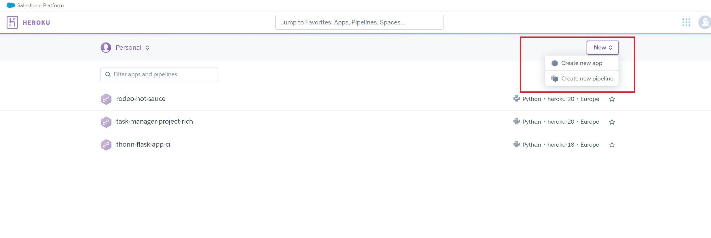
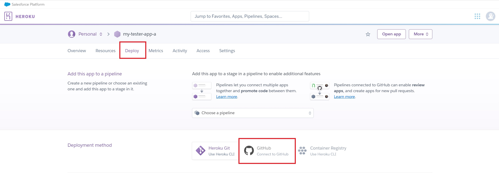
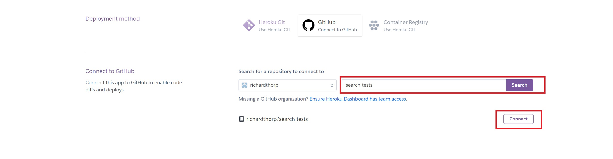
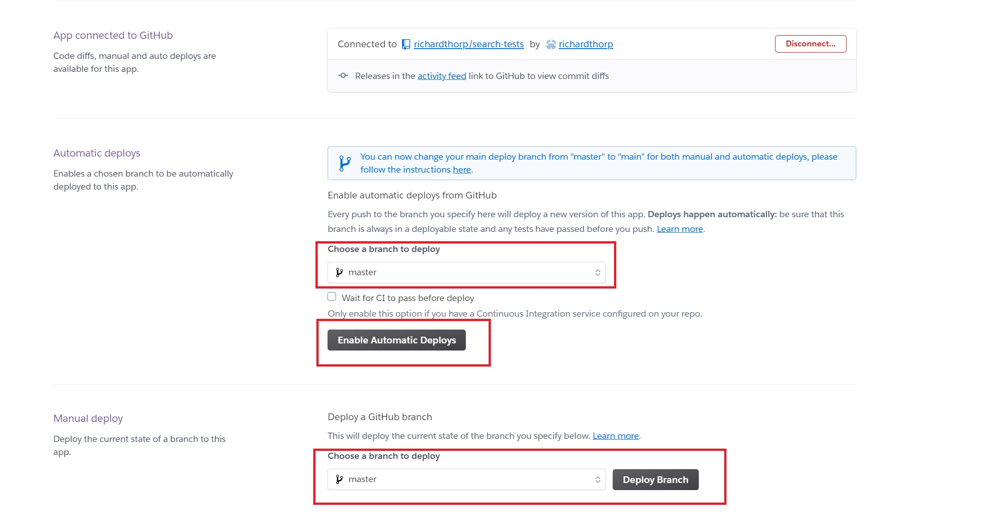
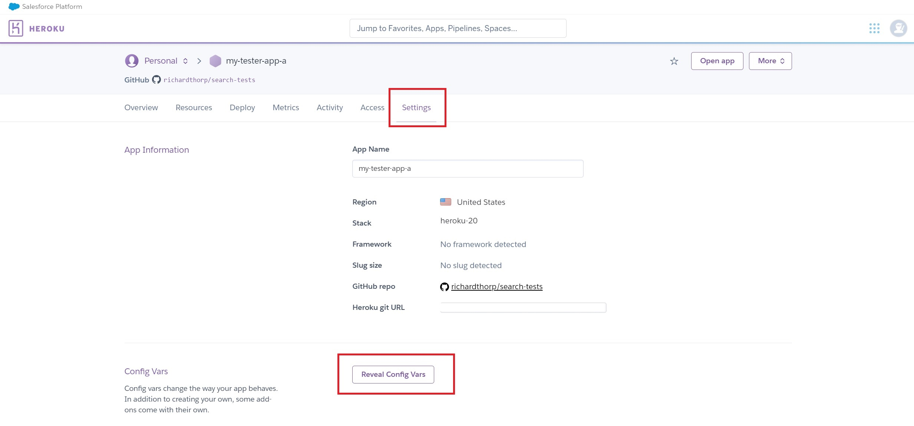
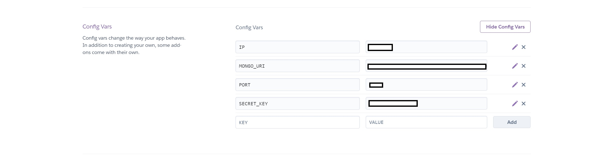

# Radiohead - Milestone 4
[Back to README](README.md)

## Deployment
### Version Control with Github
Github has been used to host the website's remote repository. To create and connect to the repository I completed the following steps:

#### Create a Github repository and Gitpod workspace
1. Log in to the **GitHub** website and click on 'New' from the 'Repositories' section in the top left of the screen.

2. Once on the 'Create a new repository' page, I selected the Code Institute template from the 'Repository template' dropdown menu, gave the repository a name and description and clicked 'Create Repository.

3. Once the repository was created, I click on the 'Gitpod' button towards the top right of the screen. This opened a new Gitpod workspace and automatically connected the workspace to the repository. 

#### Forking the Repository
If you wish to work on this project within your own repository, it can be forked using the following process:

1. Log in to your **GitHub account** on the **GitHub** website.

2. Using the search bar in the top left of the screen, search for **'richardthorp/radiohead'**.

3. Click on the search result and then click on the **'Fork'** button to the right of the screen, above the list of files and folders.

4. The repository is now 'forked' and saved in your own repository.

#### Cloning the Repository
If you wish to clone the repository to work on locally, follow these steps:

1. Log in to **GitHub** and navigate to the repository (follow step 2 from 'Forking the Repository').

2. Click on the green **'Code'** button to the top right of the list of files and folders.

3.  Copy the URL displayed underneath the **underlined 'HTTPS'**.

4. In your local IDE, launch **Git Bash** and create or navigate to the folder in which you wish to make the clone.

5. On the CLI type **'git clone'** followed by the URL copied from step 3 and press enter. You will now have a local clone of the repository.

### Deploying to Heroku

##### Gunicorn
Gunicorn is used as the server when the app is deployed to Heroku. To install Gunicorn run `pip3 install Gunicorn` and then add the package to the apps `requirements.txt` file using `pip3 freeze > requirements.txt`

##### Procfile
Heroku needs a 'Procfile' to know how to run the app. In this instance, a Profile was created in the root directory of the project with the code `web: gunicorn radiohead.wsgi:application` saved to it.

#### Create a Heroku app
Heroku provide a Postgres database to integrate with the app. To set up the database, I followed these steps:

1. Sign in/sign up to [Heroku](https://www.heroku.com/).

2. Once signed in, click on the 'Create New App' button.



3. Name the app, select the local region and click 'Create App'.

4. In the top menu, select the 'Deploy' tab, and then click 'Connect to GitHub' in the 'Deployment method' section.



5. Connect your GitHub account to your Heroku account by clicking on the 'Connect to GitHub' button (if already connected, move to step 6).

6. Search for the GitHub repository which contains the app you wish to deploy, and then click 'connect'.



7. Once connected, you can choose to automatically deploy any updates made in the GitHub repository or to do so manually by selecting the branch you wish to deploy and clicking on the appropriate button.



8. Following this, click on the 'Settings' tab and then click 'Reveal Config Vars'



9. Within the 'Reveal Config Vars' section, add the variables which would be found in your local enviroment variables. These variables are saved here as they contain sensitive data such as the passwords and secret keys.



10. Add the new app url and `localhost` to the project's `settings.py` file in the 'ALLOWED_HOSTS' section:
    * `ALLOWED_HOSTS = ['app-name.herokuapp.com', 'localhost']`

#### Set up Heroku Postgres
Heroku provide a Postgres database to be used in the project. To set up the database I followed thse steps:

1. On Heroku, within the app dashboard, click on the resources tab at the top of the page.

2. In the 'Add-ons' search bar, type in 'Heroku Postrgres' and click on the resulting option.

3. Ensure 'Hobby Dev' is selected as the plan name and click on 'Submit Order Form'. This will automatically attach the database to the app and add the database URL to the app's 'Config Vars' in the settings page. 

5. Install the packages required to integrate the app and database using pip:
    * `pip3 install dj_database_url`
    * `pip3 install psycopg2_binary`

6. Add the packages to a `requirements.txt` file in the root directory to ensure Heroku knows which dependencies are required to run the app:
    * `pip3 freeze > requirements.txt`

7. To ensure that Django's default SQLite database was used in development and the Heroku Postres database used in production, the following `if/else` statement was added to the projects `settings.py` file having imported `dj_database_url` at the top the file:

```
if 'DATABASE_URL' in os.environ:
    DATABASES = {
        'default': dj_database_url.parse(os.environ.get('DATABASE_URL'))
    }

else:
    DATABASES = {
        'default': {
            'ENGINE': 'django.db.backends.sqlite3',
            'NAME': BASE_DIR / 'db.sqlite3',
        }
    }
```

#### Push the code to Github and Deploy to Heroku
With the previous steps complete, in the project terminal run `python3 manage.py makemigrations` and then `python3 manage.py migrate` to ensure any outstanding migrations have been completed on the local database and migration files are up to date and ready to use in the deployed app.

1. Commit all changes and push to Github:
    * `git add .`
    * `git commit -m "Commit files to deploy to Heroku"`
    * `git push`
2. In the Heroku app dashobard on heroku.com, navigate to the 'Settings' tab and within the 'Config Vars' section, add a new variable set to:
    `DISABLE_COLLECTSTATIC: 1`
This is to temporarily stop Heroku collecting the app's static files as these will later be hosted using Amazon's S3 service.
3. In the 'Deploy' tab of the Heroku dashboard, click on 'Deploy Branch' with 'master' selected (this is only neccessary if automatic deploys are not enabled).
4. Once the appication has been built, click on the 'more' button at the top right of the page and click on 'Run Console'. With the console running, type the command `python3 manage.py migrate` to apply migrations to the Heroku Postrgres database.
5. Following the migrate command, create a new superuser for the deploted app using `python3 manage.py createsuperuser`.
6. The app is now deployed to Heroku.

### Host and serve static files using Amazon's S3
#### Create an S3 bucket and set up bucket permissions
1. Navigate to `aws.amazon.com` and click on 'Create a new user', fill in the 'Create a new user' form and submit the form.
2. On the following page, select the 'Personal - for your own projects' option and fill out the rest of the form and submit.
3. Next, add payment details for the account and continue with the sign up process.
4. Once signed up and signed in, search for 'S3' in the search bar at the top of the page and click on the 'S3' option.
5. On the next page, click 'Create Bucket' and then name the bucket and select the appropriate region. Under 'Block Public Access settings for this bucket', untick the 'Block all public access' option and click 'Create bucket' at the bottom of the page.
6. In the following 'buckets' page, click on the newly created bucket and in the 'properties' tab, navigate to the bottom of the page and click on 'Edit' under 'Static website hosting', setting the option to enable. Add some values to the 'Index Document' and 'Error Document' and saving the changes.
7. Click on the 'Permissions' tab and scroll down to 'Cross-origin resource sharing (CORS)', click edit. Paste the following into the textfield and click 'Save changes'

```
[
    {
        "AllowedHeaders": [
            "Authorization"
        ],
        "AllowedMethods": [
            "GET"
        ],
        "AllowedOrigins": [
            "*"
        ],
        "ExposeHeaders": []
    }
]
```
8. Still in the 'Permissions' tab, navigate to the 'Bucket policy' section and click on 'Edit'. Copy the 'Bucket ARN' from this page before clicking on the 'Policy generator' button.
9. In the policy generator, make the following changes:
    * Step 1: Select Policy Type
        * 'Select Type of Policy' : 'S3 Bucket Policy'
    * Step 2: Add Statement(s)
        * 'Principal': '*'
        * 'Actions': 'GetObject'
        * 'Amazon Resource Name (ARN)': Paste the ARN copied in step 8.
    * Click on 'Add Statement' and then 'Generate Policy'.
        * Copy the policy and paste it into the 'Edit Bucket Policy' back on the main S3 bucket page.
        * Before saving, add '/*' to the 'Resource' tab to allow access to all resources.
10. Within the 'Permissions' tab of the bucket, find the 'Access control list (ACL)' section and click on 'Edit'.
    * Next to 'Everyone (public access)', click on the 'list' checkbox before saving the changes.

#### Create a user to access the bucket
1. Navigate to the AWS Services menu and search for 'AIM', selecting the resulting IAM option.
2. Click on 'User Groups' in the menu on the left side of the page and then click 'Create group'.
3. Name the new group, giving it a name which clearly relates to the S3 bucket created in the last section and then click 'Create group'.
4. Click on 'Policies' in the menu on the left side of the page and then click 'Create policy'.
5. Click on the 'JSON' tab and then click 'Import managed policy'. Search for 'S3' in the searchbar and then click on the 'AmazonS3FullAccess' policy. Click 'Import' at the bottom of the page.
6. Find and copy the bucket ARN in the 'properties' section of the S3 buckets page.
7. Back in the 'JSON' tab on the 'Create policy' page, add the following the resource section:
```
{
    "Version": "2012-10-17",
    "Statement": [
        {
            "Effect": "Allow",
            "Action": "s3:*",
            "Resource":  [
                "arn:aws:s3:::<your bucket name>",
                "arn:aws:s3:::<your bucket name>/*"
            ]
        }
    ]
}
```
This allows access to both the bucket, and any files and folders within the bucket.

8. Click on the 'Tags' button at the bottom of the page and then the 'Next: Review' button before giving the policy a suitable name and description and clicking 'Create policy'.
9. Return to the 'User groups' by clicking the link in the menu of the left side of the page. Click on the 'Permissions' tab and then 'Add permissions'. In the 'Add permissions' dropdown, click 'Attach Policies' and select the policy created in the previous step before clicking 'Add permisions' at the bottom of the page.
10. On the 'Users' page found through the left side menu, click 'Add Users'. Give the user a name which clearly relates to the bucket and click on 'Programmatic access' under the 'Access type' section before clicking 'Next: Permissions' at the bottom of the page.
11. Select the group created in step 3, click 'Next' and click 'Next' again on the 'Add tags (optional)' page, before clicking 'Create User'.
12. Click 'Download .csv' and ensure the downloaded file is saved as this file contains the access credentials required to use the S3 bucket. 

#### Configure Django to use S3 
1. Install the package `boto3` using `pip3 install boto3`
2. Install the package `django-storages` using `pip3 install django-storages`
3. Add the packages to the `requirements.txt` file using `pip3 freeze > requirements.txt`.
4. Add `storages` to the `INSTALLED_APPS` list in `settings.py`
5. To ensure the S3 bucket is only used in production, following `if` statement should be added to `settings.py`, as well as the settings listed below:

    ```
    if 'USE_AWS' in os.environ:
    # Cache control
    AWS_S3_OBJECT_PARAMETERS = {
        'Expires': 'Thu, 31 Dec 2099 20:00:00 GMT',
        'CacheControl': 'max-age=94608000'
    }

    # Bucket config
    AWS_STORAGE_BUCKET_NAME = '<your bucket name>'
    AWS_S3_REGION_NAME = 'eu-west-2'
    AWS_ACCESS_KEY_ID = os.environ.get('AWS_ACCESS_KEY_ID')
    AWS_SECRET_ACCESS_KEY = os.environ.get('AWS_SECRET_ACCESS_KEY_ID')
    AWS_S3_CUSTOM_DOMAIN = f'{AWS_STORAGE_BUCKET_NAME}.s3.amazonaws.com'

    # Static and media files
    STATICFILES_STORAGE = 'custom_storages.StaticStorage'
    STATICFILES_LOCATION = 'static'
    DEFAULT_FILE_STORAGE = 'custom_storages.MediaStorage'
    MEDIAFILES_LOCATION = 'media_files'

    # Overide static and media URLs in production
    STATIC_URL = f'https://{AWS_S3_CUSTOM_DOMAIN}/{STATICFILES_LOCATION}/'
    MEDIA_URL = f'https://{AWS_S3_CUSTOM_DOMAIN}/{MEDIAFILES_LOCATION}/'
    ```

6. In the Heroku config vars in the app's settings page, add the following variables using the credentials found in the .csv file downloaded in step 12 of **Create a user to access the bucket**: 
    ```
    USE_AWS: True
    AWS_ACCESS_KEY_ID: <YOUR AWS ACCES KEY>
    AWS_SECRET_ACCESS_KEY_ID: <YOUR SECRET ACCESS KEY>
    ```
7. Remove the `DISABLE_COLLECTSTATIC` variable from the config vars.
8. In the root directory of the Django app, add a file called `custom_storages.py` and insert the following code:
    ```
    from django.conf import settings
    from storages.backends.s3boto3 import S3Boto3Storage


    class StaticStorage(S3Boto3Storage):
        location = settings.STATICFILES_LOCATION


    class MediaStorage(S3Boto3Storage):
        location = settings.MEDIAFILES_LOCATION

    ```

9. Add, commit and push changes to Gitpod:
    ```
    git add .
    git commit -m "Set up S3 bucket for static files"
    git push
    ```

10. If automatic deployment is not activated on Heroku, navigate to the app's 'deploy' page on Heroku and click 'Deploy Branch'. Heroku will now build the app and collect local static files before uploading them to the new S3 bucket.

### Sending emails
The application sends emails to users after the following actions:
* User registration
* Shop app purchase
* Portal subscription purchase
* Portal subscription payment over-due

In development, emails are logged to the console. This is achieved with the following settings in `settings.py`:

    ```
    if 'DEVELOPMENT' in os.environ:
    EMAIL_BACKEND = 'django.core.mail.backends.console.EmailBackend'
    DEFAULT_FROM_EMAIL = 'radioheadms4@example.com'
    ```

In production, emails are sent using a Gmail account which can be set up using the following proccess:

1. Create a Gmail at `https://accounts.google.com/`
2. In the menu at the top right of the page click on 'Account'.
3. Click on 'Security' in the menu on the left of the page. On this page, ensure '2-step Verification' is turned on and then click on 'App passwords'.
4. Create a new app password in the 'App passwords' screen, selecting 'Mail' from the 'Select app' dropdown and giving the password a suitable name (ie. Django).
5. Click 'Generate' and copy the newly created app password.
6. Within the main email page, click on the cog icon in the top right of the page and then click 'See all settings'. Under the 'Forwarding and POP/IMAP' tab, ensure the 'Enable IMAP' setting is enabled in 'IMAP access'.
7. On Heroku and in the app's settings page, add the following variables to the 'Config vars':
    ```
    EMAIL_HOST_PASSWORD: <The password created in step 5>
    EMAIL_HOST_USER: <the email address created in step 1>
    ```
8. Back in the `settings.py` file in the Django app, add the following code in an `else` statement under the existing email settings:
    ```
    if 'DEVELOPMENT' in os.environ:
        EMAIL_BACKEND = 'django.core.mail.backends.console.EmailBackend'
        DEFAULT_FROM_EMAIL = 'radioheadms4@example.com'
    <INSERT THIS CODE>
    else:
        EMAIL_BACKEND = 'django.core.mail.backends.smtp.EmailBackend'
        EMAIL_USE_TLS = True
        EMAIL_PORT = 587
        EMAIL_HOST = 'smtp.gmail.com'
        EMAIL_HOST_USER = os.environ.get('EMAIL_HOST_USER')
        EMAIL_HOST_PASSWORD = os.environ.get('EMAIL_HOST_PASSWORD')
        DEFAULT_FROM_EMAIL = os.environ.get('EMAIL_HOST_USER')
    <END OF INSERTED CODE>
    ```
9. Emails will now be sent to real email addresses when users interact with the app on Heroku, and emails will be logged to the console in development.