# Radiohead Milestone 4 - Testing
[Back to README](README.md)

### Testing against Website Objectives
* Functionality to sell music and merchandise.
    * This objective is met via the Shop app.
* Promote upcoming concerts.
    * This objective is met via the Live app.
* Provide a platform for the band to announce news and release content.
    * This objective is met via the Portal app.
* Financially capitalise on fans.
    * This objective is met via both the Portal and Shop apps. Additionaly, as users need an email address to sign in to the website, these email addresses can be used for marketing campaigns or upcoming promotions etc.

### Testing against User Stories
#### As a first time user, I want:
* To quickly understand the purpose of the website.
    * The landing page feaures the animated text 'Welcome to the home of Radiohead' ensuring the user understands this is a website about Radiohead.
    * The home page features a brief summary of what users can find in the Portal app.
    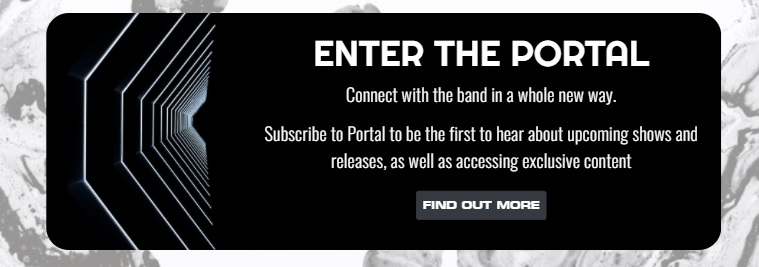
    * The website is designed using standard UX principles, such as providing links to the other pages in the header.
        * All navigation links have names that are quite clear as to what content they links to.
* To be able to register and sign in easily.
    * All pages feature the profile icon which triggers a dropdown with links to the registration and sign in pages.
    * A profile icon that either links directly to or provides links to account features is a common feature throughout web design and will be recognised by users as such.
    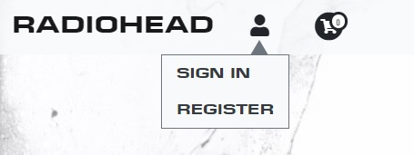
* To be able to sign out easily.
    * Again, as the profile dropdown is present on every page, the user can quickly and easily sign out.
* To be able to navigate through the website intuitively and easily.
    * Navigation links are easily accessible on all pages of the website. As the website features common UX principles, navigating through the pages is intuitive.
    
    * All relevant pages feature 'back to' links so the user doesn't have to rely on the main navigation links to navigate the site.
* To find content relating to the band Radiohead.
    * As this website features only content relating the band Radiohead, this user story is met!

#### As a returning user, I want:
* To be able to log in and out easily and to be able to remain signed in.
    * As with the **first time user** user story, this requirement is met via the profile icon in the navigation bar.
    * On the sign in page, the option to 'remember me' is presented enabling the user to return to the website and be automatically logged in.
    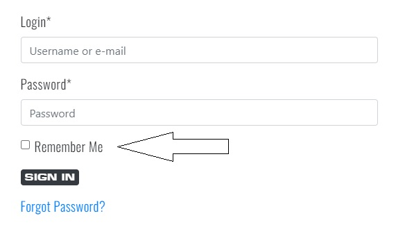
* To be able to reset my password should I forget it.
    * The sign in page offers a link that states 'forgot password?' which links to a page that allows users to input their email address and be sent a reset password link. 
    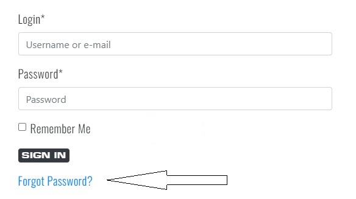
* To be able to find details about my previous orders.
    * The profile page features a, 'Orders' section containing a list of previous orders.
        * By clicking on a previous order, users can view th details of that order, including items orderered, costs and delivery information.
        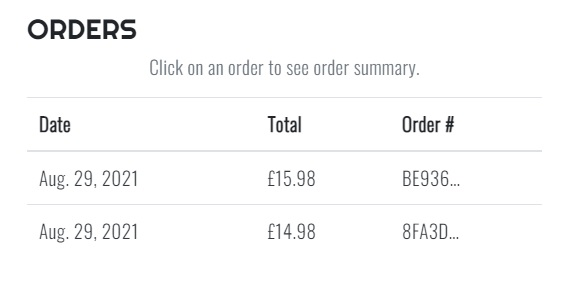
* To be able to view details about my subscription.
    * The profile page features a 'Subscriptions' section.
        * The subsciptions section shows users when their subsciption payment is due, as well as which card will be charged.
        * If the user cancels their subscription, text is rendered tell the user when the subscription will end.
        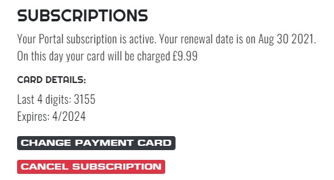
* To be able to easily cancel my subscription.
    * The profile page offers an obvious button to 'Cancel Subscription', which stops the user being charged when their susbcription renewal date is reached. Users can still access the Portal content until this date however.
    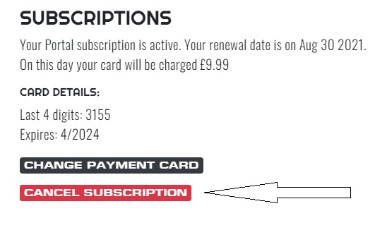
* To be able to easily reactivate my subscription after cancelling.
    * If the user wishes to reactivate their subsciption before the current billing period has ended, a button to 'Reactivate Subscription' is presented.
    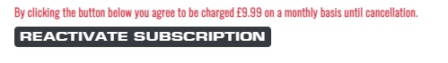
* To be able to change my subscription payment card.
    * The profile page offers an obvious link to 'Change Payment Card'
    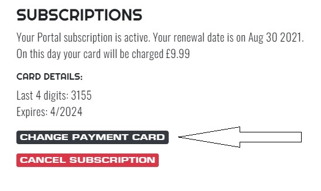
* To be able to save my details to use for any future purchases.
    * Any page that includes a form to collect users data features a checkbox which enables the user to save their information for next time.
    * The profile page features a form for users to add or update their default details.
    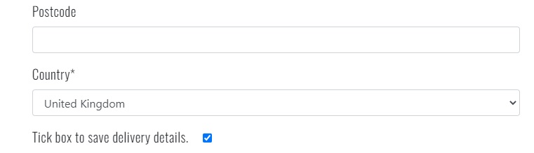
* To be able to find new merchandise quickly in the shop.
    * Items in the shop are by default listed with newest items at the top of the page.
* To be able to find new music quickly in the Media section.
    * Albums on the media page are by default listed with the newest albums at the top of the page.
* To be able to view new content quickly in the Portal area.
    * Posts on the Portal page are by default listed with the newest posts at the top of the page.

#### Shared user requirements:
* To be able to communicate with other fans of the band.
    * Users can comment on pages in both the Media and Portal apps.
    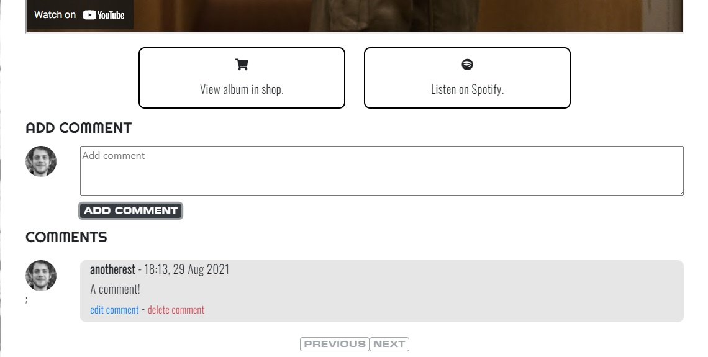
* To be able to buy music and merchandise from the band.
    * Users can make purchases though the shop app.
* To be able to find details about upcoming concerts.
    * Users can view upcoming concerts though the Live app.
        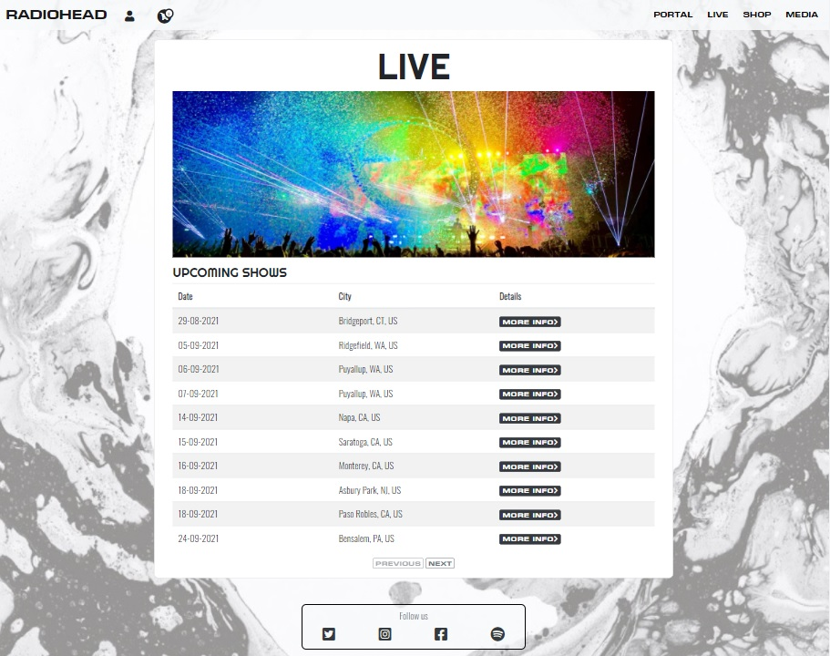
* To be able to find and consume music.
    * Users can find and consume music though the Media app.
* To be able to find recent news, updates and other content.
    * Users can get updates though the Portal app.

## Technical Testing
### Validation
#### HTML
The HTML code has been validated with the [W3C Markup Validator](https://validator.w3.org/). This was done by copying the HTML code from Chrome Dev Tools once rendered in the browser, for all pages whilst both logged in and logged out of the website, and pasting the code into the validator. This was necessary to test the code in its final state after being processed by the django templates. The HTML code contains no validity issues.

#### CSS and Javascript
The CSS code has been validated with the [W3C CSS Validator](https://jigsaw.w3.org/css-validator/) and the JavaScript with the [JS Hint](https://jshint.com/) code analysis tool, with any issues highlighted by the validators fixed. The code contains no validity issues.

#### Python
All Python code was written to be PEP 8 compliant. **ADD ANY FINAL WARNINGS HERE**

### Responsive testing
The website has been developed and tested to ensure a high level of responsiveness. This has been achieved using Google Chrome Dev Tools, testing on different physical devices as listed below and by viewing the site on [Am I Responsive?](http://ami.responsivedesign.is/).

#### Responsive testing procedure
Check that text, images and all other elements load with correct styles and spacing on all pages. On mobile and tablet, rotate the screen to landscape orientation and repeat the checks. Whilst testing on a laptop, using each browsers developer tools, resize the page and ensure all elements respond to the screen size accordingly.

The tests detailed in this section were all completed using the following web browsers and hardware:
|                            | Chrome             | Edge             | Firefox            | Safari |
| -------------             |:------------------:| -----------------:|-------------------:|--------:|
| Microsoft Surface 3 (15") | :heavy_check_mark: |:heavy_check_mark: | :heavy_check_mark: |         |
| Samsung Galaxy A6         | :heavy_check_mark: |:heavy_check_mark: | :heavy_check_mark: |         |
| Huawei P Smart 2019       | :heavy_check_mark: | :heavy_check_mark:| :heavy_check_mark: |         |
| Macbook Pro 2016 (13")    | :heavy_check_mark: |                   | :heavy_check_mark: | :heavy_check_mark: |
| iPad 7th generation 2019  | :heavy_check_mark: |                   | :heavy_check_mark: |:heavy_check_mark: |

### Automated Testing
The website has been thoroughly tested using the in-build django testing functionality. These tests can ensure the following:

* Views return correct templates, status codes, and any additional data expected to be returned, as well as ensuring that they interact with the database correctly. Tests were also written to ensure certain user credentials are required to access restricted areas of the website.
* Forms return the correct string method values, any required fields are rendered as such and ensure the order of the fields when rendered on the front-end are correct.
* Models accept the correct data types and that any functions attached to the model's class behave accordingly.

The package 'Coverage' was used to assess how much of the code is being tested by the automated tests. The coverage report states that 92% of the code has been covered by the tests.

Any functions that include calls to the Stripe API were not included in the unit testing. These areas of the code have been tested manually as detailed in the **Manual Testing** section below.

### Manual Testing
#### Stripe subscriptions
In order to test the subscription functionality, a Stripe 'Product' was created in the [stripe.com](http://www.stripe.com) dashboard. The product was set to charge customers every day, and if a charge was unsuccessful for any reason, the subscription be cancelled. This allowed me to test the integration with the website using a variety of customers and test payment cards and get results daily. 
Whilst possible to send test webhooks via the Stripe website, it was important to implement tests using webhooks which contained the same additional metadata and other attributes which were attached to the users subscription by them interacting with the website.

##### **Creating a Portal subscription**
1. As a newly registered user, click on the link to 'Portal' and follow the links through to the 'Portal Sign Up' page.
    * On [www.stripe.com](http://www.stripe.com), navigate to the 'Customers' section, and ensure a Stripe customer has been created with the new users email attached.
2. Back on the 'Portal Sign Up' page, complete the form, using the Stripe test card details (card number: 4242 4242 4242 and any valid expiry and zipcode) to check out.
    * On the Stripe website, navigate to the 'Subscriptions' section and ensure a new subscription has been created with the users email address attached.
    * On the Stripe website, and within the 'Developers' section, navigate to the webhooks page.
        * Ensure that an 'invoice.payment_succeeded' webhook has been sent successfully.
            * Ensure that a 'customer.subscription.updated' webhook has been sent successfully after the 'invoice.payment_succeeded', and that within the webhook object, the 'default_payment_method' value and that the metadata attribute contains the users email, name and address.
            * Ensure that the 'status' attribute of the 'customer.subscription.updated' is 'active'.
3. Ensure new user is now be signed into the Portal.
4. Ensure that the 'portal_cancellation' email is either logged to the console in developement, or the actual email is sent in production.
5. When signed in as a superuser, navigate to the 'Profiles' page of the Django admin and click on the new users profile.
    * Ensure that the 'Portal Cust ID', 'Subscription ID' and 'Subscription status' all have values saved to them.
6. Sign out and back in again with the new user.
    * Click on the 'Portal' link in the navigation bar.
        * Ensure the user is redirected to the 'Portal Content' page.
    * Navigate to the 'Profile' page.
        * Ensure the relevant details and buttons are rendered in the 'Subscriptions' section.

##### **Update the subscription payment card**
1. Sign in as a user with an active subscription and navigate to the 'Profile' page.
    * Click on the 'Change Payment Card' button and enter the new card details.
        * On the Stripe webhooks page, ensure a 'customer.subscription.updated' webhook was sent successfully and the 'previous_attributes' field contains 'default_payment_method'.
    * Back on the 'Profile' page, ensure that the last 4 digits of the new card are now displayed under 'Card Details'.

##### **Cancel a Portal subscription**
1. Sign in as a user with an active subscription and navigate to the 'Profile' page.
    * Click on the 'Cancel Subscription' button.
        * Ensure the the information in the 'Subscriptions' section of the 'Profile' page now states 'Your Portal subscription is due to expire on ???. Would you like to re-activate your subscription?
        * On the Stripe webhooks page, ensure a 'customer.subscription.updated' webhook was sent successfully and that the 'cancel_at_period_end' field is set to 'true'.

2. The following day, ensure that the 'customer.subscription.deleted' webhook was sent successfully.
    * Try to access the 'Portal Content' and ensure the user is redirected to the 'Portal Info' page.
    * Navigate to the 'Profile' page and under the 'Subscription' section ensure the text reads 'You do not currrently have a Portal subscription'.
    * As a superuser and in the Django admin, ensure that the webhook handler correctly removed all subscription information from the users profile.
    * Via the Stripe payments page, ensure no further charges for the customer are made or attempted.
    * Ensure that the 'portal_cancellation' email is either logged to the console in developement, or the actual email is sent in production.

##### **Reactivate a cancelled subscription**
1. Complete step 1 from **Cancel a Portal Subscription** above.
2. Navigate to the 'Profile' page and click on 'Reactivate Subscription' button.
    * On the Stripe webhooks page, ensure a 'customer.subscription.updated' webhook was sent successfully and that the 'cancel_at_period_end' field is set to 'false'.
3. The following day, via the Stripe payments page, ensure the payment is collected successfully.

##### **Testing a failed payment**
1. Follow the steps to **Update the Subscription Payment Card** above.
    * When it comes to inputting the new card details, use the card number 4000 0000 0000 0341. This card number allows the card to be 'attached' to the user, but when it comes to charging the customer, the payment fails.
    * Once the payment has failed, ensure that the 'customer.subscription.deleted' webhook was sent successfully.
        * Try to access the 'Portal Content' and ensure the user is redirected to the 'Portal Info' page.
        * Navigate to the 'Profile' page and under the 'Subscription' section ensure the text reads 'You do not currrently have a Portal subscription'.
        * As a superuser and in the Django admin, ensure that the webhook handler correctly removed all subscription information from the users profile.
        * Via the Stripe payments page, ensure no further charges for the customer are made or attempted.
        * Ensure that the 'portal_cancellation' email is either logged to the console in developement, or the actual email is sent in production.

#### Stripe Checkout
##### **Checkout as anonymuus User**
1. Within the shop, add items to the basket and then navigate to 'Checkout'. 
    * Enter the details into the checkout form and checkout using the Stripe test card. 
    * As a superuser and in the Django admin, ensure an Order instance has been created in database along with the corresponding Order Line Items.
    * Ensure that the 'confirmation_email' email is either logged to the console in developement, or the actual email is sent in production.
2. On the Stripe webhooks page, ensure a 'payment_intent.succeeded' webhook was sent successfully and that the  'billing_details' field contains the users address and that the 'metadata' field contains a summary of the items bought.

##### **Checkout as signed-In user**
1. Within the shop, add items to the basket and then navigate to 'Checkout'. 
    * Enter the details into the checkout form and checkout using the Stripe test card. 
    * As a superuser and in the Django admin, ensure an Order instance has been created in database along with the corresponding Order Line Items.
    * Ensure that the 'confirmation_email' email is either logged to the console in developement, or the actual email is sent in production.
2. On the Stripe webhooks page, ensure a 'payment_intent.succeeded' webhook was sent successfully.
    * Ensure that the 'billing_details' field contains the users address and that the 'metadata' field contains a summary of the items bought.
3. On the 'Profile' page, ensure that the order is listed in the 'Orders' section, and that clicking on the order takes the user to the 'Order Details' page.

##### **Ensure order is created by webhook if necessary.**
1. Within 'stripe_elements.js' in the 'static' folder of the 'Checkout' app, comment out ```form.submit();``` on line 96.
2. Within the shop, add items to the basket and then navigate to 'Checkout'. 
    * Enter the details into the checkout form and checkout using the Stripe test card.
    * Ensure that the form has not been submitted - this will be apparent as the loading overlay screen will still be present. 
    * As a superuser and in the Django admin, ensure an Order instance has been created in database along with the corresponding Order Line Items. 
3. On the Stripe webhooks page, ensure a 'payment_intent.succeeded' webhook was sent successfully.
    * Ensure that the 'billing_details' field contains the users address and that the 'metadata' field contains a summary of the items bought.
    * Ensure that the 'Response' section of the webhook states ```Webhook received: payment_intent.succeeded. 'Order created in webhook.'```
4. On the 'Profile' page, ensure that the order is listed in the 'Orders' section, and that clicking on the order takes the user to the 'Order Details' page.

### Found Bugs
#### Django-crispy-forms bug
A bug was found whilst testing the 'Add Portal Post' functionality of the website. On submission of an invalid form, the Django debug screen would show ```PortalTextPost object is not iterable```. The traceback contained references to 'django-crispy-forms', and so the form was re-tested without 
using the crispy-form tags and no error was thrown.
The website no longer uses 'django-crispy-forms' on 'AddTextPostForm', 'AddVideoPostForm' or 'AddImagesPostForm' but the styles have been applied via the form's init methods and via regular CSS styling via an external stylesheet.

#### Mobile screen fixed background bug
When viewing the page on a mobile device (specifically Chrome on Android), the fixed background would contain a gap at the bottom when the page was scrolled. This was due to CSS for the background stating the the height should be 100vh. When the content was scrolled, the address bar for Chrome would dissapear but the background would not expand. 
The solution was to use a Javascript function that listened for a window resize event, and set the background height accordingly.

[Back to README](README.md)
